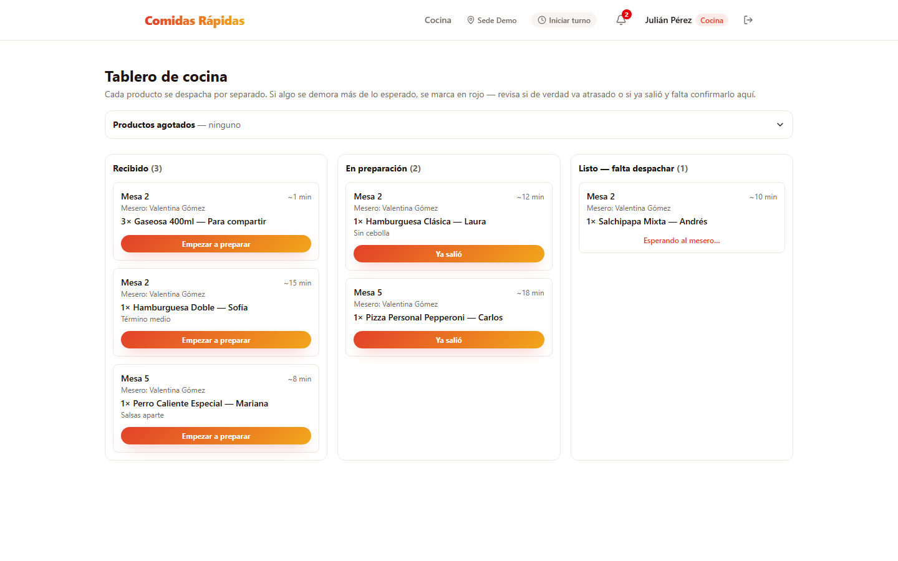
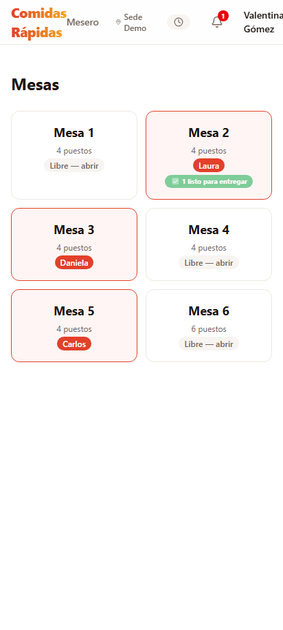
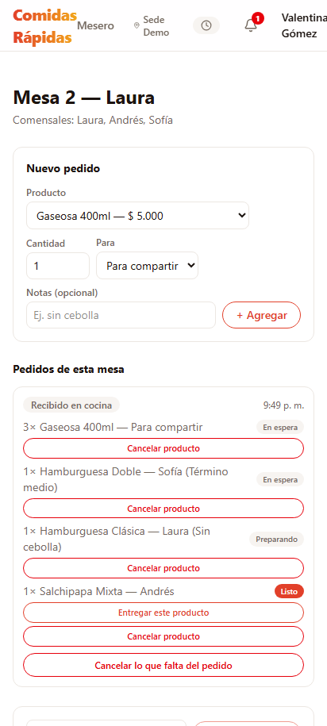
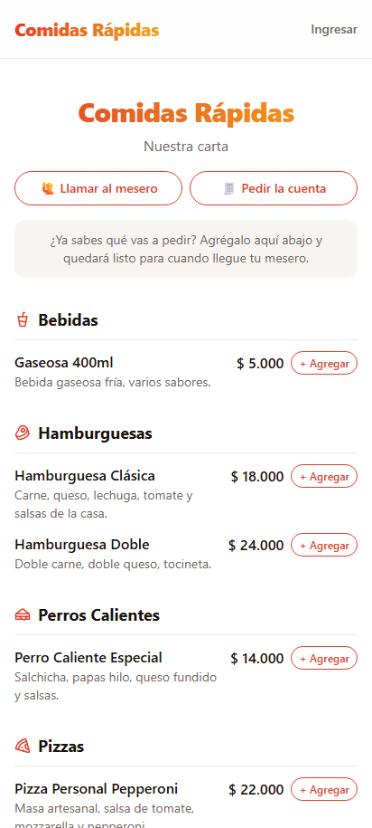
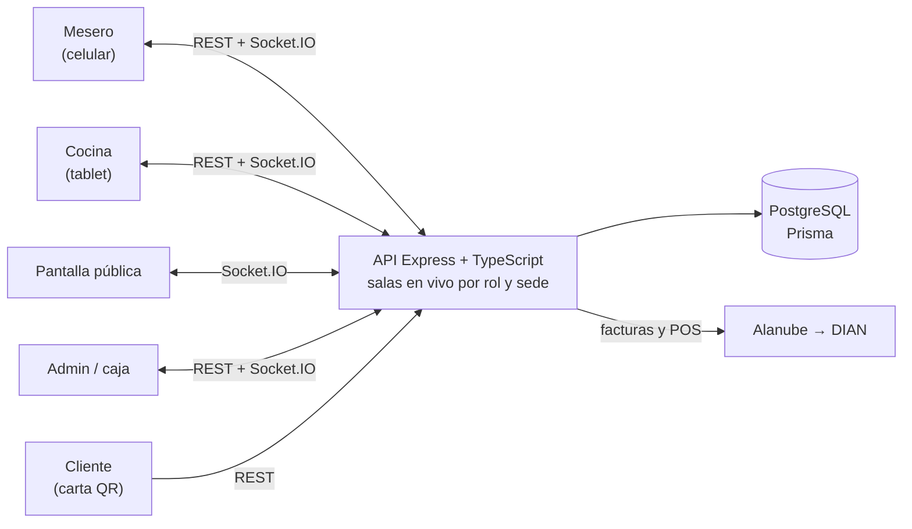

# Comidas Rápidas — pedidos en tiempo real para restaurantes

Sistema completo para restaurantes de comida rápida: el mesero toma los pedidos en el celular, la cocina los recibe al instante y los despacha plato por plato, el cliente puede pedir desde el QR de su mesa, y la administración maneja caja, inventario, costos, facturación electrónica DIAN y varias sedes.

> **Construido dirigiendo un agente de IA** (Claude Code). Yo definí el producto, las reglas del negocio, las prioridades y cómo se verificaba cada fase; el agente escribió el código, las migraciones y las pruebas. Detalle en [Cómo se construyó con IA](#cómo-se-construyó-con-ia).



<table>
  <tr>
    <td align="center"><br><sub>Mesas del mesero</sub></td>
    <td align="center"><br><sub>Pedido por comensal</sub></td>
    <td align="center"><br><sub>Carta por QR del cliente</sub></td>
  </tr>
</table>

<sub>Capturas con datos de ejemplo (sede y personas ficticias).</sub>

## Qué hace

**Mesero (celular)**
- Abre la mesa con sus comensales y toma el pedido de cada persona, con notas ("sin cebolla") y productos para compartir o para llevar.
- Ve en vivo qué está listo para entregar y entrega plato por plato.
- Agrega comensales, cambia de mesa, genera la precuenta por persona con propina voluntaria y cobra con pago dividido (efectivo, tarjeta, Nequi, Daviplata, transferencia).
- Dos meseros nunca atienden la misma mesa; el administrador puede reasignarla.

**Cocina (tablet o pantalla)**
- Tablero en tiempo real: recibido → en preparación → listo, producto por producto.
- Alertas sonoras de pedidos nuevos, listos y retrasados según el tiempo de preparación de cada producto.
- Marca productos agotados y todos los meseros de la sede lo ven al instante.

**Cliente**
- Escanea el QR de su mesa: ve la carta, deja armado su pedido para que el mesero lo confirme, llama al mesero o pide la cuenta.
- QR de mostrador para pedir y recoger, con página de seguimiento del pedido y hora estimada.
- Encuesta de satisfacción al final.

**Administración**
- Caja: cierres con cuadre por mesero, entradas y salidas de efectivo, cuentas perdidas autorizadas con clave de supervisor.
- Costos y ganancia por producto, ingeniería de menú, estado de resultados, gastos y punto de equilibrio.
- Inventario por unidades y por ingrediente (recetas), con alertas de stock bajo.
- Combos, adiciones, promociones por día y hora, descuentos autorizados.
- Domicilios propios y de apps (Rappi, etc.) con su comisión.
- Turnos del personal y reparto de propinas (por mesero o en pozo, con porcentaje para cocina).
- Clientes frecuentes con programa de puntos (con autorización de datos, Ley 1581).
- Facturación electrónica DIAN y documento POS por medio de Alanube.
- **Varias sedes**: cada una con sus mesas, personal, cocina, inventario, caja y numeración; un administrador general ve todas o cada una.

## En cifras

| | |
|---|---|
| Modelos de datos | 40 |
| Rutas de API | 126 |
| Pantallas | 27 |
| Migraciones de base de datos | 27 |
| Comprobaciones automáticas de extremo a extremo | 405 (16 archivos de pruebas) + 15 pruebas unitarias |
| Tiempo de construcción | 27 y 28 de septiembre de 2026 (19 commits) |

## Arquitectura



| Capa | Tecnologías |
|---|---|
| Frontend | Next.js 16 (App Router), React 19, TypeScript, Tailwind CSS v4, Zustand |
| Backend | Node.js, Express, TypeScript, zod |
| Tiempo real | Socket.IO con salas por rol (cocina, meseros, pantalla) y por sede |
| Datos | PostgreSQL (Neon), Prisma ORM |
| Integraciones | Alanube / Alegra e-provider (facturación electrónica DIAN), códigos QR |
| Calidad | Pruebas de extremo a extremo propias, pruebas unitarias (node:test), verificación del esquema contra la base |

## Cómo se construyó con IA

**Reparto del trabajo**

| Yo (producto y dirección) | El agente de IA (Claude Code) |
|---|---|
| Definí qué construir y las reglas del restaurante | Propuso la arquitectura y escribió el código |
| Corregí el diseño cuando no correspondía a cómo trabaja un restaurante | Escribió las migraciones, incluidas las de datos |
| Prioricé las fases y decidí qué quedaba por fuera | Escribió y corrió las pruebas en cada fase |
| Exigí evidencia: pruebas contra el sistema real y datos de prueba limpios | Resolvió los bloqueos del entorno (red corporativa con proxy) |
| Tomé las decisiones con consecuencias: datos personales, facturación, credenciales | Documentó cada fase en el commit y en notas del proyecto |

**Decisiones de producto que cambiaron el diseño**
- La cocina despacha **plato por plato**, no el pedido completo: cambió todo el modelo de estados.
- **Dos meseros nunca atienden la misma mesa**, y el administrador puede reasignarla si un mesero se enferma.
- El primer comensal **es** el responsable de la mesa (antes se contaba aparte y el cupo quedaba mal).
- Un cliente que se va sin pagar queda como **pérdida autorizada con clave**, no como una venta falsa.
- **Varias sedes** con un administrador general y administradores por sede.

**Cómo avanzó** (según el historial de commits)
1. MVP completo: mesas, pedidos por comensal, cocina en tiempo real, cuenta.
2. Hoja de ruta de un análisis propio: integridad y seguridad de sesiones, robustez contra abuso, reporte de ventas y cierre de caja, seguimiento para el cliente, operación diaria, preparación para producción, pruebas en el repositorio.
3. Fase de negocio 1: ganancia, pagos digitales, control del efectivo, clave de supervisor, inventario, llamados y encuestas desde el QR.
4. Fase 2: ofertas, pago dividido, domicilios y apps, gastos, estado de resultados, turnos y propinas.
5. Fase 3: facturación electrónica DIAN, inventario por ingrediente, clientes con puntos, varias sedes.

**Cómo se verificó**
- Cada fase se cerró con pruebas de extremo a extremo contra la API real: operaciones simultáneas (dos meseros abriendo la misma mesa, cobros a la vez), permisos por rol y por sede, eventos en tiempo real, cálculos de caja y de propinas.
- Las pruebas crean sus propios datos y los borran al terminar, aunque fallen.
- Las migraciones de datos se ensayaron dentro de una transacción que se revierte antes de aplicarlas.
- La facturación electrónica se probó contra un simulador local de la API de Alanube (misma API documentada).

## Correr en local

Requisitos: Node.js 20+ y una base PostgreSQL (por ejemplo, la capa gratuita de [Neon](https://neon.tech)).

```bash
# Backend (http://localhost:4001)
cd backend
cp .env.example .env        # DATABASE_URL, JWT_SECRET, FRONTEND_URL, SEED_ADMIN_PASSWORD
npm install
npx prisma migrate deploy
npx prisma db seed          # categorías, productos, mesas y el administrador inicial
npm run dev

# Frontend (http://localhost:3010)
cd frontend
cp .env.example .env.local  # NEXT_PUBLIC_API_URL; NEXT_PUBLIC_URL_PUBLICA antes de imprimir QR definitivos
npm install
npm run dev
```

Para probar la carta QR desde un celular en la misma red WiFi, agrega la IP del equipo en `FRONTEND_URL` (backend) y en `NEXT_DEV_ALLOWED_ORIGINS` (frontend).

## Pruebas

```bash
cd backend
npm test                                   # unitarias
E2E_PASSWORD=<clave> npm run test:e2e      # de extremo a extremo (con el backend corriendo)
npm run db:verificar                       # el esquema coincide con la base
```

Requisitos, cuentas de prueba y precauciones en [backend/tests/README.md](backend/tests/README.md).

## Estado

Funcional de punta a punta en local. Pendiente: desplegar una demo pública, usar credenciales reales de Alanube (se probó con su ambiente de pruebas y un simulador) e integración continua en GitHub Actions.

---

### English summary

Real-time ordering system for fast-food restaurants: waiters take orders on their phones, the kitchen receives them instantly and dispatches dish by dish, customers can order from a table QR code, and managers handle the cash register, inventory, costs, Colombian e-invoicing (DIAN) and multiple branches. Built with Next.js, Express, Socket.IO, PostgreSQL and Prisma by **directing an AI coding agent (Claude Code)**: I defined the product, business rules, phases and verification; the agent wrote the code and 400+ automated end-to-end checks.
